# udacity-nd-aws-ml-enginerr-project2
This contains the code submitted for the second project in the [Udacity AWS Machine Learning Engineer nanodegree](https://www.udacity.com/course/aws-machine-learning-engineer-nanodegree--nd189).

# Project background
## Information provided by Udacity

Image Classifiers are used in the field of computer vision to identify the content of an image and it is used across a broad variety of industries, from advanced technologies like autonomous vehicles and augmented reality, to eCommerce platforms, and even in diagnostic medicine.

You are hired as a Machine Learning Engineer for a scone-delivery-focused logistics company, *Scones Unlimited*, and you’re working to ship an Image Classification model. The image classification model can help the team in a variety of ways in their operating environment: detecting people and vehicles in video feeds from roadways, better support routing for their engagement on social media, detecting defects in their scones, and many more!

In this project, you'll be building an **image classification model** that can automatically detect *which kind of vehicle delivery drivers have*, in order to route them to the correct loading bay and orders. Assigning delivery professionals who have a bicycle to nearby orders and giving motorcyclists orders that are farther can help Scones Unlimited optimize their operations.

As an MLE, your goal is to ship a **scalable and safe** model. Once your model becomes available to other teams on-demand, it’s important that your model **can scale to meet demand**, and that **safeguards are in place to monitor and control** for drift or degraded performance.

In this project, you’ll use AWS Sagemaker to build an **image classification model** that can *tell bicycles apart from motorcycles*. You'll deploy your model, use AWS Lambda functions to build supporting services, and AWS Step Functions to compose your model and services into an event-driven application. At the end of this project, you will have created a portfolio-ready demo that showcases your ability to build and compose scalable, ML-enabled, AWS applications.

## Dataset
In this project we will use the [CIFAR-100](https://www.cs.toronto.edu/~kriz/cifar.html) dataset, which consists of small RGB images (32 x 32 pixels) from 100 different classes. 


<em>Example CIFAR-100 images ([Source](https://www.google.com/url?sa=i&url=https%3A%2F%2Fwww.kaggle.com%2Ffedesoriano%2Fcifar100&psig=AOvVaw2AfxCKMgKv04lCGT9zz5hG&ust=1647262836403000&source=images&cd=vfe&ved=0CAwQjhxqFwoTCLDV1LWSw_YCFQAAAAAdAAAAABAD)).</em>

In this project we will just use two classes; the bicycle bike and motorbike images.

# Running project
In this section I include a summary of what was done for each part of the project. Some parts of the project are run from the `start.ipynb` notebook. Other parts were done in the AWS console, such as creating Lambda and Step Functions. 

Note that you need to create a SageMaker Notebook Instance (or SageMaker Studio) and upload the `starter.ipynb` notebook. You will need to edit things such as S3 bucket URIs to ones that you have access to.

## Step 1: Data staging
This part is all done within the `starter.ipynb` notebook. It can be run using the **Python 3 (Data Science)** kernel and the **ml.t3.medium** instance.

### Download CIFAR-100 dataset

The first job is to download the CIFAR-100 dataset using the `requests` module. This downloads the `tar.gz` file from [here](https://www.cs.toronto.edu/~kriz/cifar-100-python.tar.gz) to the same folder as where the notebook is located in SageMaker. 

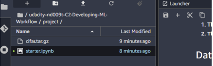

<em>Downloaded tar.gz file.</em>

### Decompress data
The file is a tar.gz file (gzipped), which means that it is compressed. This is convenient for distributing the data and the hosting service as it saves on bandwidth. To work with these types of files we can use the **tarfile** utility in the Python standard library. 

```
import tarfile

with tarfile.open("cifar.tar.gz", "r:gz") as tar:
    tar.extractall()
```
This creates a new dirtectory, which contains three pickle files.

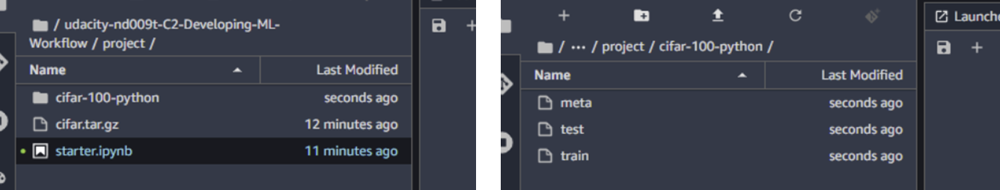

<em>Extracted files from cifar.tar.gz.</em>

### Transform data
Each of the pickle files contains a dictionary. The most important keys in the datasets are:

- **data**: A 10000x3072 Numpy array of uint8s. Each row of the array stores a 32x32 colour image. The first 1024 entries contain the red channel values, the next 1024 the green, and the final 1024 the blue. The image is stored in row-major order, so that the first 32 entries of the array are the red channel values of the first row of the image.
- **labels**: A list of 10000 numbers in the range 0-9. The number at index *i* indicates the label of the *i*th image in the array **data**.

The meta dictionary contains the names that correspond to the labels:
- **label_names**: A 100-element list which gives meaningful names to the numeric labels in the labels array described above. For example, label_names[0] == "airplane", label_names[1] == "automobile", etc.

We needed to reshape the data images into RGB image format (i.e. 32x32x3 arrays). This was accomplished using the code below: 

```
import numpy as np

row = dataset_train[b'data'][0]

test_image = np.dstack((
    row[0:1024].reshape(32,32),
    row[1024:2048].reshape(32,32),
    row[2048:].reshape(32,32)
))

```

### Save images
The CIFAR-100 dataset contains 100 different classes, but here we only want the bicycle and motorcycle data, which correspond to labels 8 and 48 respectively. The data was filtered for these two classes and then the images saved to the `train` and `test` folders. 

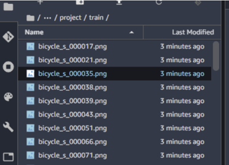

<em>Example images output to trainin folder.</em>

### Upload data to S3 bucket
Here we upload the images that were created in the previous step to our S3 bucket. The data needs to be in S3 in order to train a model. 

To upload the data we need to create a session with the `sagemaker` SDK. Note that it's best to define the `default_bucket` within the `Session` object to be an S3 bucket you've created. If you son't sepcify this then AWS will create a new bucket for you (if one doesn't already exist for SageMaker). 

```
import sagemaker
from sagemaker.session import Session
from sagemaker import get_execution_role

session = Session(default_bucket='robsmith155-courses') # Change to the name of your own S3 bucket

bucket= session.default_bucket()
print("Default Bucket: {}".format(bucket))

region = session.boto_region_name
print("AWS Region: {}".format(region))

role = get_execution_role()
print("RoleArn: {}".format(role))
```
To upload to S3 we use the following code: 

``` 
import os

os.environ["DEFAULT_S3_BUCKET"] = bucket
!aws s3 sync ./train s3://${DEFAULT_S3_BUCKET}/udacity-aws-nd/course2/project/data/train/
!aws s3 sync ./test s3://${DEFAULT_S3_BUCKET}/udacity-aws-nd/course2/project/data/test/
```

**Important:** Make sure that your SageMaker execution role has a policy attached allowing it to acces and write to S3 buckets. If not, then go to the **IAM** console and add the **AWSS3FullAccess** policy.

After running this you should see that the data has been uploaded to your S3 bucket.

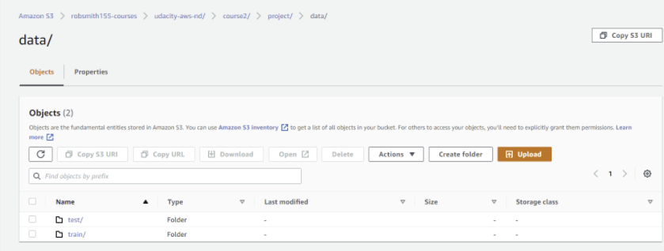

<em>Training and test images uploaded to S3 bucket.</em>


## Stage 2: Model training and deployment
Now that we have transformed the data and uploaded it to an S3 bucket we can train a model. Here we run the **Model Training** section in the notebook, which uses the AWS [image-classification](https://docs.aws.amazon.com/sagemaker/latest/dg/image-classification.html) image for training and deploys the model as an endpoint for realtime predictions.

### Train model
Here we are going to use a predefined image provided by Amazon. First we need to retrieve this image.
```
from sagemaker import image_uris
algo_image = image_uris.retrieve(framework='image-classification', region=region)
s3_output_location = f"s3://{bucket}/udacity-aws-nd/course2/project/models/image_model"
```

Next we create an instance of the **Estimator** class, where we specify things like what instance type to use, the number of instances and where to store the outputs.

```
img_classifier_model=sagemaker.estimator.Estimator(
    image_uri=algo_image,
    role=role,
    instance_type='ml.p2.xlarge',
    instance_count=1,
    output_path=s3_output_location,
    sagemaker_session=session    
)
```
Before we train a model, we need to specify some hyperparameter using the `set_hyperparameters()` method on the Estimator.

```
classifier_model.set_hyperparameters(
    image_shape= "3,32,32"
    num_classes= 2,
    num_training_samples= 1000
)
```
**Note:** The image shape must be a string without spaces. If you put “3, 32, 32” it will fail, as will (3,32,32). Here I’m assuming that it is using PyTorch and they take care of reshaping the data so that channels are in the first dimension.

The image-classification image uses four input channels with very specific input parameters. Udacity provided us with the code to set this up correctly. Note that I changed the data paths to be the correct location in my S3 bucket. 

```
from sagemaker.debugger import Rule, rule_configs
from sagemaker.session import TrainingInput
model_inputs = {
        "train": sagemaker.inputs.TrainingInput(
            s3_data=f"s3://{bucket}/udacity-aws-nd/course2/project/data/train/",
            content_type="application/x-image"
        ),
        "validation": sagemaker.inputs.TrainingInput(
            s3_data=f"s3://{bucket}/udacity-aws-nd/course2/project/data/test/",
            content_type="application/x-image"
        ),
        "train_lst": sagemaker.inputs.TrainingInput(
            s3_data=f"s3://{bucket}/udacity-aws-nd/course2/project/data/train.lst",
            content_type="application/x-image"
        ),
        "validation_lst": sagemaker.inputs.TrainingInput(
            s3_data=f"s3://{bucket}/udacity-aws-nd/course2/project/data/test.lst",
            content_type="application/x-image"
        )
}
```
Now we can train the model by calling the `fit()` method on the Estimator and passing the inputs created above.

```
img_classifier_model.fit(inputs=model_inputs)
```
**Note:** If you are running this on your own account, you may need to make a request to AWS support to increase the allowance for ths `ml.p2.xlarge` instance type if you don't already have it. Or you can change to a different instance which you alreday have allowance for, but note it may run slower if you use something else.

Once the job is running, if you go to the **Training > Training Jobs** tab in SageMaker, you should see that a new job has been created. 

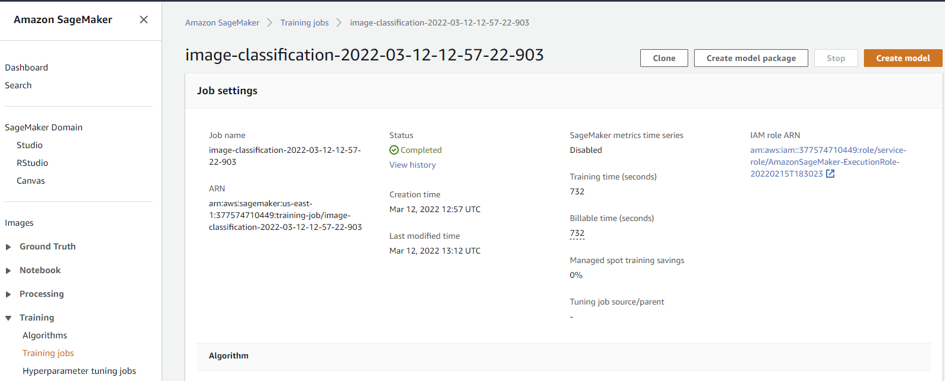

<em>Training job created in SageMaker.</em>

If we go into CloudWatch we can see the metrics that are recorded as part of the training:

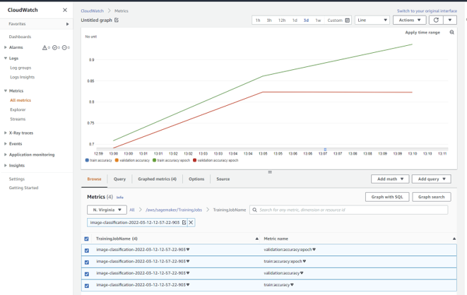

<em>Training job metrics plotted in CloudWatch.</em>

Obviously we have overfitting here as the training accuracy is still improving while the validation accuracy plateaus. I'm not sure if the algorithm automatically accounts for this and takes an earlier checkpoint. In any case, the main point of this project is not to achieve the best model, but to understand how we can train and deploy it in SageMaker. 

### Deploy model
To deploy the model we create an endpoint so that predictions can be made in real-time. We want to track what the model does, so we configure **Model Monitor** which will allow us to go back and review the requests made and responses given by the endpoint. The configuration below saves all requests and responses to the defined S3 folder.

```
from sagemaker.model_monitor import DataCaptureConfig

data_capture_config = DataCaptureConfig(
    ## TODO: Set config options
    destination_s3_uri=f"s3://{bucket}/udacity-aws-nd/course2/project/monitoring/data_capture",
    enable_capture=True,
    sampling_percentage=100
)
```
Now we can use the `deploy()` method on the Estimator object we just trained to create the endpoint. In this case we use one **ml.m5.xlarge** instance. 

```
deployment = img_classifier_model.deploy(
    ## TODO: fill in deployment options
    data_capture_config=data_capture_config
    initial_instance_count=1,
    instance_type='ml.m5.xlarge'
    )

endpoint = deployment.endpoint_name
```
After running this, if you go to **Inference > Endpoints** in the SageMaker console, you should see that an endpoint has been created. 

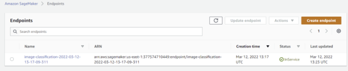

<em>Endpoint created in SageMaker.</em>

**Note:** Here SagaMaker has given a unique name to the endpoint but it's probably better that we specify a name when we deploy it using the `endpoint_name` parameter. This means that when we delete and recreate the endpoint, the name will remain the same and we don't need to change later code (e.g. in the Lambda functions).

**Important:** Make sure to delete the endpoints if not in use as you will be charged for the amount of time they are running.

### Redeploying model
Note that it is expensive to leave an endpoint running, so if you will not complete everything in one go you should delete it and recreate an endpoint later. While it is possible to completely re-run the model training and deployment, this is a waste of time and resources. 

Instead, we can use the **Model** class from the SageMaker SDK (see [here](https://sagemaker.readthedocs.io/en/stable/api/inference/model.html)) to use the model that was trained before. Here I needed to pass the S3 URI which contains my trained model data. Once the instance is created we can use the `deploy()` method to create the endpoint.

```
from sagemaker.model import Model

ENDPOINT_NAME='bike-motorbike-image-classifier'

model_data = "s3://robsmith155-courses/udacity-aws-nd/course2/project/models/image_model/image-classification-2022-03-12-12-57-22-903/output/model.tar.gz"

model = Model(image_uri=algo_image, model_data=model_data, role=role)
deployment = model.deploy(
    initial_instance_count=1, 
    instance_type="ml.m5.xlarge", 
    data_capture_config=data_capture_config, 
    endpoint_name=ENDPOINT_NAME)
```
### Make prediction using the endpoint
To make a prediction, we need to create an instance of the **Predictor** class and pass to it the name of the endpoint that we want to use (which is also running) and a SageMaker session. 

```
predictor = sagemaker.predictor.Predictor(endpoint_name=ENDPOINT_NAME, sagemaker_session=session)

```

To make a prediction, we need to pass it the data in the correct format. Here we use the **IdentitySerializer** and open the file in bytes format (to be honest I'm not 100% sure about this step).

```
from sagemaker.serializers import IdentitySerializer
import base64

predictor.serializer = IdentitySerializer("image/png")
with open("./test/bicycle_s_001789.png", "rb") as f:
    payload = f.read()

    
inference = predictor.predict(payload)
```

This should return two values. These are the predictions from the model corresponding to the probability that the input image is a bike and motorcycle respectively. 

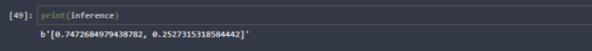

<em>Model prediction output example.</em>

## Stage 3: Lambda and Step Functions
In this part, we create three Lambda functions (for data generation, image classification and filtering) which we then chain together in an AWS Step Function. 

Note that all of the work in this section is done in the AWS console rather than the notebook.

### Lambda function 1: Data processing
The first Lambda function is used to copy a data sample from an S3 bucket, encode it using base64 and return it as the output from the Lambda function. 

First we need to create a new Lambda function. This can be done from the AWS Lambda console. Click on **Create function** and give it a name and use **Python3.8** as the runtime. Then click on **Create function**.

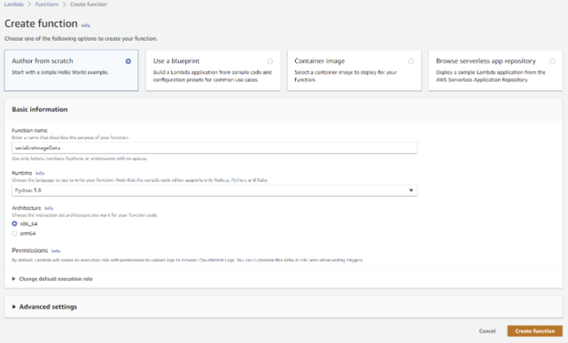

<em>Create new Lambda function.</em>

We need to make sure that the Lambda function has the permissions needed to perform the task. In this case, it needs to retrieve data from S3 and also work with Step Functions. Once the function is created, you can click on **Configuration > Permissions** where you should see the role name. Clicking on this link will take you to the **IAM** page where you can add the needed policies (e.g. **S3FullAccess**, **AWSStepFunctionsFullAccess** and **SageMakerFullAccess**). Note that ideally we use the minimum policies needed to get the job done.

Now we can create the `lambda_function` to perform this task. 

```
import json
import boto3
import base64

s3 = boto3.resource('s3')

def lambda_handler(event, context):
    """A function to serialize target data from S3"""

    # Get the s3 address from the Step Function event input
    KEY = event["s3_key"]
    BUCKET_NAME = event["s3_bucket"]

    # Download the data from s3 to /tmp/image.png
    s3.Bucket(BUCKET_NAME).download_file(KEY, '/tmp/image.png')

    # We read the data from a file
    with open("/tmp/image.png", "rb") as f:
        image_data = base64.b64encode(f.read())

    # Pass the data back to the Step Function
    print("Event:", event.keys())
    return {
        'statusCode': 200,
        'body': {
            "image_data": image_data,
            "s3_bucket": BUCKET_NAME,
            "s3_key": KEY,
            "inferences": []
        }
    }
```

To test the function we need to create a Test event, such as the one below:

```
{
  "image_data": "",
  "s3_bucket": "robsmith155-courses",
  "s3_key": "udacity-aws-nd/course2/project/data/test/bicycle_s_000030.png"
}
```

When the function is working, it should return a status code of 200 along with the encoded image like shown below. 

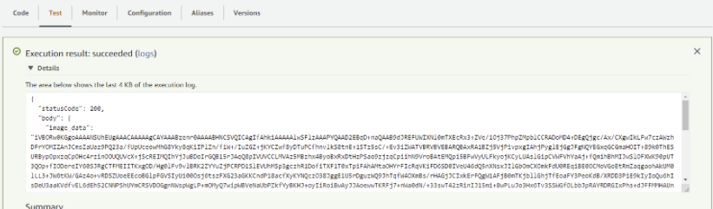

<em>Successful test of Lambda function.</em>

**Note:** You may need to increase the amount of time that the Lambda function can run for, as the default is 3 seconds. This can be done under the **Configuration > General Configuration > Edit** page.

### Lambda function 2: Image classification
This takes the encoded image from teh first Lambda function and uses it to make a prediction from our model endpoint. The function can be created like in the first example, except that this one does not need the S3 polciy to be attached. 

**Important:** An important note to make here is that the Python 3.8 runtime used by the Lambda functions only contains the standard Python librray along with the AWS boto3 SDK. It does not include the sagemaker SDK. If we want to use other packages, we need to follow the instructions found [here](https://docs.aws.amazon.com/lambda/latest/dg/python-package.html#python-package-create-with-dependency), where the packages are uploaded as zip files. In this case we can create a SageMaker session using **boto3**, so we don't need to use this method.

Here I used **boto3** to create a client of the SageMaker runtime SageMakerRuntime (see [here](https://boto3.amazonaws.com/v1/documentation/api/latest/reference/services/sagemaker-runtime.html#SageMakerRuntime.Client.invoke_endpoint)). This means that we no longer need to import the sagemaker package, so we don’t need to upload a zipped version of it. The example [here](https://aws.amazon.com/blogs/machine-learning/call-an-amazon-sagemaker-model-endpoint-using-amazon-api-gateway-and-aws-lambda/) is a nice example of using this approach.

```
import json
#import sagemaker
import base64
#from sagemaker.serializers import IdentitySerializer
import boto3

# Fill this in with the name of your deployed model
ENDPOINT_NAME = 'image-classification-2022-03-12-14-32-09-003'

runtime = boto3.client('runtime.sagemaker')

def lambda_handler(event, context):

    # Decode the image data
    image = base64.b64decode(event['body']['image_data'])

    # Make prediction from endpoint
    response = runtime.invoke_endpoint(EndpointName=ENDPOINT_NAME, ContentType='image/png', Body=image)
    inferences = json.loads(response['Body'].read().decode('utf-8'))
    
    return {
        'statusCode': 200,
        'body': {
            "image_data": event['body']['image_data'],
            "s3_bucket": event['body']['s3_bucket'],
            "s3_key": event['body']['s3_key'],
            "inferences": inferences
        } 
    }
```
This adds the inferenece results to the event which is returned by the Lambda function.

Note that to test the function, you can copy the output from the test run for the first Lambda function, which contains the encoded image data.

### Lambda function 3: Filter low confidence results
The final Lambda function is used to disgard a prediction is the probability output by the model is less than a threshold value (in this case 93 %).

The code for this Lambda function is:

```
import json


THRESHOLD = .93


def lambda_handler(event, context):

    # Grab the inferences from the event
    inferences = event['body']['inferences']

    # Check if any values in our inferences are above THRESHOLD
    #meets_threshold = ## TODO: fill in
    meets_threshold = any(x > THRESHOLD for x in inferences) 

    # If our threshold is met, pass our data back out of the
    # Step Function, else, end the Step Function with an error
    if meets_threshold:
        pass
    else:
        raise("THRESHOLD_CONFIDENCE_NOT_MET")

    return {
         'statusCode': 200,
         'body': {
            "image_data": event['body']['image_data'],
            "s3_bucket": event['body']['s3_bucket'],
            "s3_key": event['body']['s3_key'],
            "inferences": event['body']['inferences']
            }
    }

```
To test this function, you should copy the output from the second Lambda function test. A successful outcome will have a status code of 200 and include the inference probabilities.

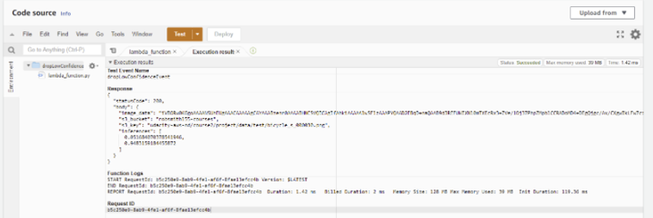

<em>Output of successful test on third Lambda function.</em>

### Step Function
No we can chain the three Lambda functions together in a Step Function. Again this is done from the AWS Step Function dashboard (it can be done using the SDK but is much easier in the dashboard/console).

Here we click on **Create state machine**:

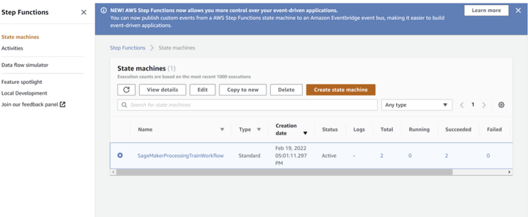

<em>Create new Step Function.</em>

Then choose the **visual workflow** and **Standard** options. 

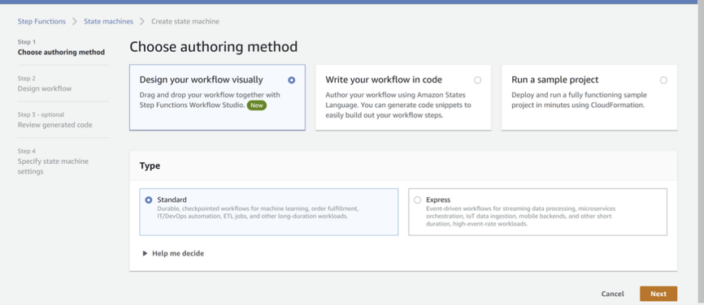

<em>Create new Step Function options.</em>

Now we can drag and drop three Lambda functions into the workflow and then configure them to use the three functions that we created. 

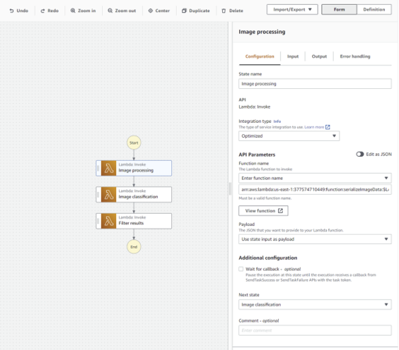

<em>Step Function workflow.</em>

After setting up the Step Function in the visual editor, we can create it and let AWS generate the IAM execution role for us. We can then test the step function (state machine). For this we need to provide an example input in the correct format, such as below. 

```
{
  "image_data": "",
  "s3_bucket": "robsmith155-courses",
  "s3_key": "udacity-aws-nd/course2/project/data/test/bicycle_s_000030.png"
}
```
For an image which outputs a prediction with proabability > 93 %, all three of the Lambda functions should succeed (denoted by the green boxes below).

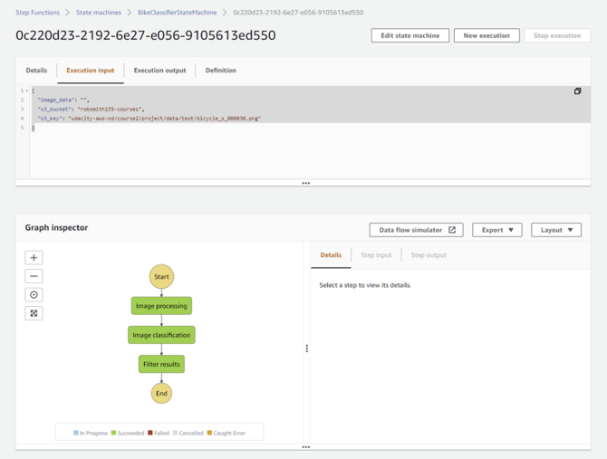

<em>Successful Step Function example.</em>

For images with a prediction probability of less than the threshold (93 %), we should see that the final step in the step function fails, like shown below.

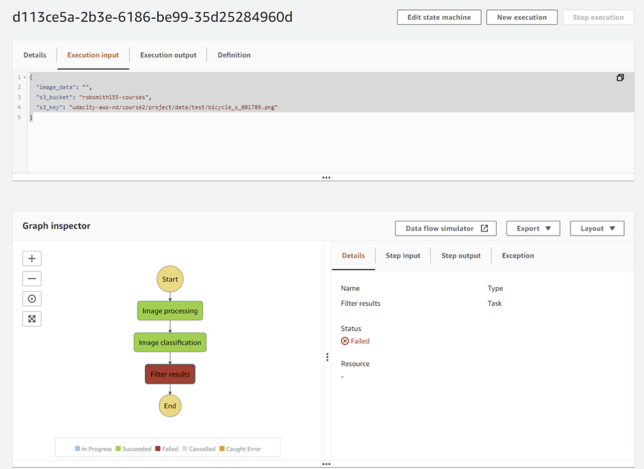

<em>Unsuccessful Step Function example.</em>

Note that this is how we were told to create the Step Function (i.e. if the prediction probability is less than the threshold we should get a 'loud' failure).

## Step 4: Testing and evaluation
In the final part we perform several invokations of the step function using data from the test dataset. We use he data captured by the SageMaker Model Monitor to visualize some of this data. This part is done inside the `starter.ipynb` notebook and in Step Function console.

We're provided with a function that will generate a random example from the test dataset. 

```
import random
import boto3
import json


def generate_test_case():
    # Setup s3 in boto3
    s3 = boto3.resource('s3')
    
    # Randomly pick from sfn or test folders in our bucket
    objects = s3.Bucket(bucket).objects.filter(Prefix="udacity-aws-nd/course2/project/data/test")
    
    # Grab any random object key from that folder!
    obj = random.choice([x.key for x in objects])
    
    return json.dumps({
        "image_data": "",
        "s3_bucket": bucket,
        "s3_key": obj
    })
generate_test_case()
```
The output from `generate_test_case()` is in the correct format for passing to the step function. 

Go to the step function in the AWS console, click on **New execution** and paste the output generated in the notebook. 

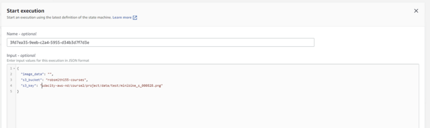

<em>New step function execution input.</em>

Click **Start execution** and this will run the step function with the new data. As long as it has a prediction probability > 93 % then it will return a 200 status code.

We repeat this process for a few images. All of these requests are captured by Model Monitor an stored in my S3 bucket as `.jsonl` files.

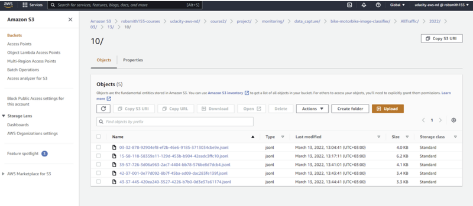

<em>Data captured by Model Monitor.</em>

In the notebook, we then run two examples of loading and using the data that is captured by Model Monitor. The image below shows the prediction probabilities of the examples that were run:

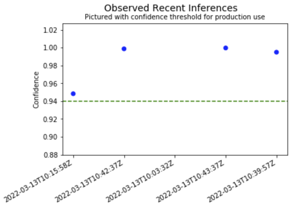

<em>Inference data captured by Model Monitor.</em>

The second figure also makes use of the data sent my the request to plot the image data and corresponding model inference.

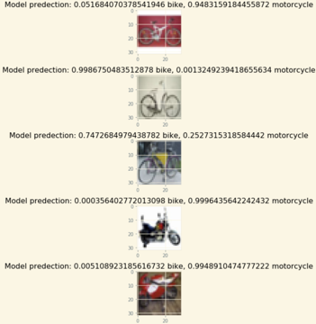

<em>Inference data and images captured by Model Monitor.</em>
